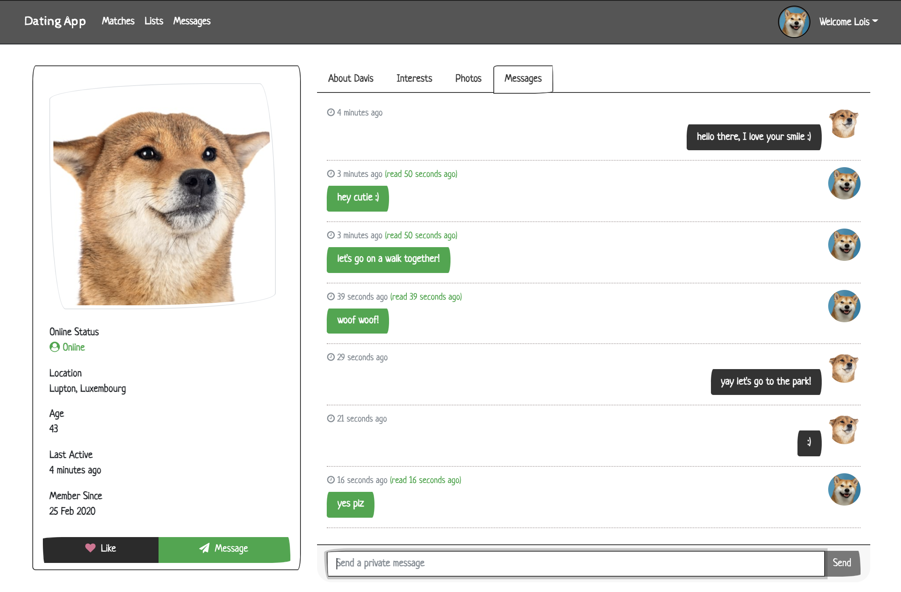

### Description

[Demo](https://pet-dating-app.herokuapp.com)

A simple dating app built with .NET Core 5, Angular 10 and Bootstrap 4. Currently desktop only.

---

### Setup

Database is being hosted on a dockerized pg sql instance. If you do not have docker, install docker and setup docker container (see, e.g., https://hub.docker.com/_/postgres):

`docker run --name {dockerContainerName} -e POSTGRES_USER={userName} -e POSTGRES_PASSWORD={password} -p {portToBindToPostgres}:5432 -d postgres:latest`

1. get a cloudinary account, and update the fields in `CloudinarySettings` of your `appsettings.json` with your credentials.
2. create a `appsettings.Development.json` file under `API`, copy the properties from `appsettings.json` and fill them out. Make sure you are pointing your database connection to a pgsql db.
3. `cd` to `API`, run `dotnet restore`, and set your aspnetcore environment to `Development`
4. run `dotnet watch run` to setup db, seed data, and spin up APIs
5. `cd` to `client` and run `npm i`
6. run `ng serve` to spin up angular project
7. either register with a new user or login to existing usernames with the seeder password you've set in `appsettings.Development.json`, or login as admin with username `admin` and the seeder password you've set in `appsettings.Development.json` to use the app.
8. have fun!

---

### Dotnet API

`cd` to `API`

Generate Initial Migrations:

`dotnet ef migrations add ${MigrationName} -o Data/Migrations`

Generate Migrations:

`dotnet ef migrations add ${MigrationName}`

Remove Migrations:

`dotnet ef migrations remove`

Apply Migrations/Create Database:

`dotnet ef database update`

Drop Db:

`dotnet ef database drop`

Run Project:

`dotnet watch run`

Note: seed data are generated via: https://www.json-generator.com/

To quickly convert the models to typescript interfaces, use the JSON to TS extension in VSCode and paste the returned values from the API there.

---

### Angular

`cd` to `client`

`npm i`

Run Project:

`ng serve`

---

### Deployment

Currently, I am hosting this on heroku (which uses pgsql as its db), with the angular app being served via .net. You will need the heroku cli installed in your system.

It is recommended that you generate your keys/password via https://passwordsgenerator.net/

1. Go to heroku and create a new app, and then under the resources tab, add the Heroku Postgres addon
2. Go to settings tab, and under Config Vars, enter the key:value pair settings of your `appsetting.json`
3. Login to heroku via its CLI and add heroku to your remote: `heroku git:remote -a {appName}`
4. Set dotnetcore buildpack for the app: `heroku buildpacks:set https://github.com/jincod/dotnetcore-buildpack`
5. Set your heroku environment to production: `heroku config:set ASPNETCORE_ENVIRONMENT=Production`
6. Build production output of angular project: `cd client` and `npm run build:prod` and commit them the output to the codebase (do not gitignore these, heroku needs the file!)
7. Deploy dotnet project: `git push heroku master`

Once you've setup your heroku app, you can just repeat steps 6 & 7 for continuous deployment, unless you need to add further environment variables.

---
##### Features to be implemented / Bugs to be fixed, in no particular order:

- RWD
- photo upload progress bar not reflective of actual progress; gets stuck when file too big
- impl unread messages badges via signalr
- swiping left/right like tinder
- block/report users, admin can read/respond to reports and ban users
- separate admin angular project with statistics displayed via ngx charts, manage users and content, etc.
- events / news / announcement center
- user location / google map api integration
- forget password / confirm email functionality via asp core identity
- cooler homepage with banners and animations, needs design
- likes notification / badge
- add paged/search functionality to both admin panel tabs
- pet/owner photo? turn this into a dating app for pets? :p
